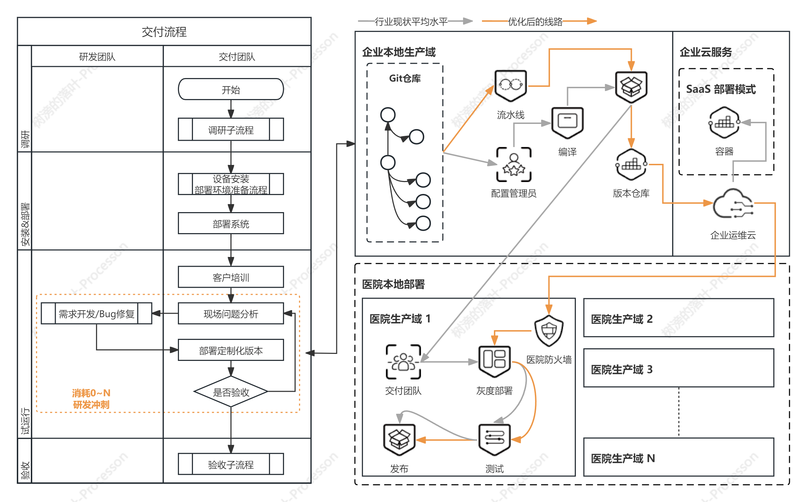
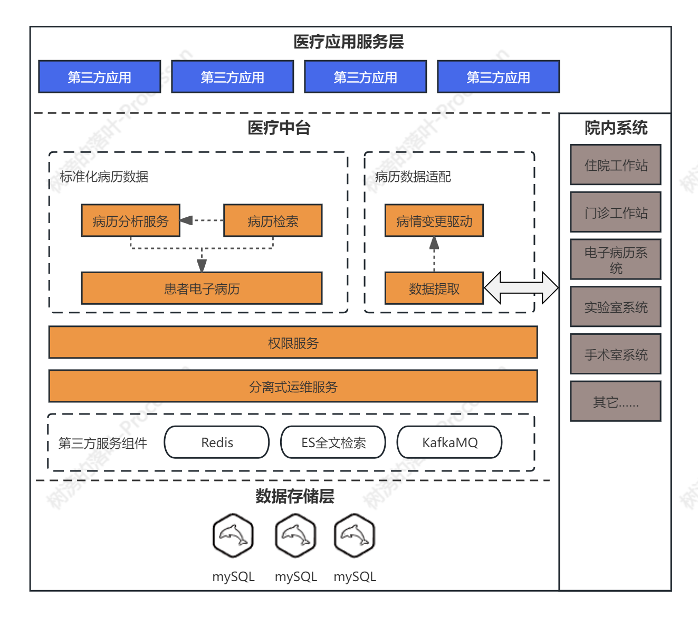
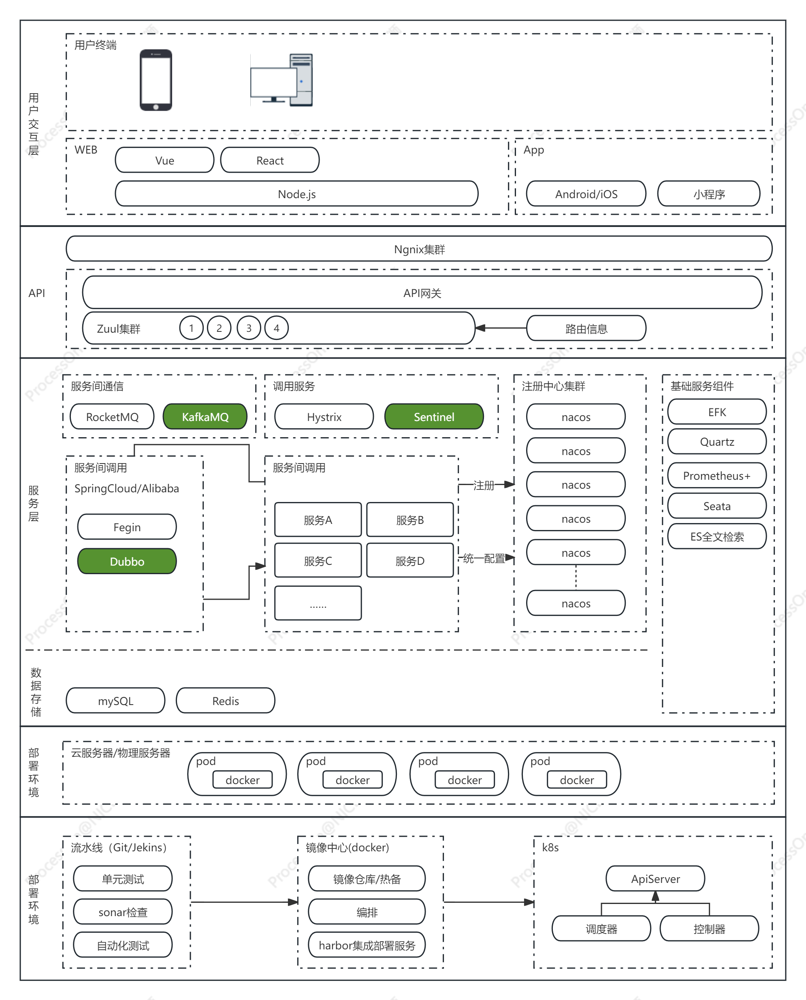

# 从系统供应商角度分析痛点

## 医疗数据“脏”且“少”

### 信息化建设过“重”

## 医疗一体化效果差

## 传统交付方式的高成本

### 本地化部署是主流

由于我国医疗服务主要由公立医疗机构承担，在这里我们先不讨论私立医疗机构的情况，以下除特别说明，只讨论公立医疗体系下的医疗机构。国内医疗机构的信息系统交付方式主要分为两大类：集中部署(如 SaaS)、本地化部署，在交付的过程中有如下特征：

- 大型医疗机构医疗系统
  - 医疗生产系统，几乎全是本地化部署方式，不接受集中部署方式
  - 医院运营相关系统，由于大部分需要与医疗数据交换，几乎全是本地化部署方式
  - 患者服务系统，可以接受集中部署方式，不愿意接受多家医疗机构在同一个应用内
- 小型医疗机构(社康医院)
  - 医疗生产系统以各地卫健委为单位，进行统计的部署，原则仍然是在区域卫生信息专网进行部署

### 交付方式转变是必然

交付方式从本地化部署转变为集中部署，一定会带来成本的下降，故:

- 供应商：优先降低成本将更容易获取更大的市场份额
- 医疗机构
  - 采购成本降低，采购方式从一次性支付向分期支付转变，医院预算会更加灵活
  - IT 团队管理与系统运维需要的人力极巨下降，可以将精力更聚焦到医疗机构本身的业务
  <!-- - 管理部门：医疗机构在IT上的成本下降，增强支出预算的灵活性 -->

### 交付方式转变周期很长

要促成“新”交付方式探索与转变，有以下几个必要条件，而满足以下条件的国内医疗机构寥寥无几，都是各个区域的顶级医疗机构。

- **医疗机构本身有动力**
  - 有动力、有把握将信息化建设成果转换为管理“政绩”的医疗机构，如长期作为医院信息化建设“开路人”梯队的医疗机构
  - 行政管理权统一的多个医疗机构的联合，多医疗机构数据互联互通是管理团队的痛点，如随着城镇化发展，大部分市级以上三级医院都已经拥有了自己的分院
- **医疗机构有匹配的信息化实力**
  - 拥有 IT 团队有能力制定顶层设计，有研发能力，并能够良好的管理供应商将设计蓝图落地
  - 拥有战略合作级别的医疗信息化供应商，且供应端的技术能力可以达成目标
- 拥有区域标杆医院改革成功案例后，经历逐步试点 → 形成政府指导意见 → 普及，一个“五年计划”内完基本都不可能完成整个过程

### 成本管理挑战

面向企业的软件销售(解决方案销售)，本质是通过一套解决方案给客户提供可持续服务，这个解决方案除了软件本身以外，还包含但不限于客户业务咨询、客户员工培训、系统运维等等。**本文将只聚焦在交付过程与产品技术实现相关的成本管理，销售、交付管理等等其它成本不在本文的讨论中**。_图 1 医院交付过程</u>_ 左半部分描述了在产品交付中研发团队、运维交付团队协作的概要过程。其中技术架构影响到的范围，主要集中在试运行期间。

#### 试运行期间的成本管理

试运行期间通常为项目上线期间高风险环节，当风险失控时最直接的表征为：**定制需求永远开发不完，客户总是不满意**，成本上升体现在以下 3 个方面：

1. 对研发资源的持续占用，不论用哪种开发模型，必然带来成本上升
2. 实施交付周期加长，持续增加实施成本
3. 由于客户满意度下降，需要付出更多的隐形成本

根据过往的经验，当试运行阶段出现风险失控时，通常会有以下原因和现象伴随出现，本文着重讨论产品架构部分：

- 产品架构设计缺陷
  - 对系统高可用设计不足: 系统稳定性差，达不到高可用指标
  - 功能扩展性设计不足: 功能开发周期长
  - 组件、模块、服务间耦合度高: 系统稳定性、可靠性差
- 对产品的效果过度宣传、缺失宣讲：产品不能满足客户的预期效果
- 对产品边界以外的承诺：产品不能满足客户的预期效果
- 产品设计成熟度不足
  - 功能设计灵活性不足：产品定制化需求多
  - 交互设计灵活性不足：能满足客户的业务使用需求，但是不好用
  - 实施方案设计不足：产品定制化需求多
- 现场项目进度管理失控
  - ……

#### 系统部署成本高

由于未来很长一段时间本地化部署仍然是医院的主流，但是集中式部署又是发展的必然。所以系统还需要降低本地化部署成本的同时，兼容集中式部署方式。_图 1 医院交付过程</u>_ 右半部分描述了从企业内部生产环境到客户交付的过程
 - 集中式部署：已经有非常成熟的DevOps整体解决方案，架构需要能够兼容此部署方式即可
 - 分布式部署：
   - 默认读者已理解集中式部署对比分布式部署的成本节省
   - 灰色流程为目前行业内大部分企业采用的主要方案
   - 橙色流程为实现分布式部署的流水线，这样可以将成本尽可能向集中式部署看齐，由于市场并没有成熟的框架或产品来解决这个问题，故此为本次架构需要实现的核心特性

# 中台架构设计

## 架构特性

根据以上痛点分析，架构设计时将考虑以下特性

- 交付成本
- 系统数据应用，而非数据生产
- 区域化医疗数据支持
- 最低人员配置

# 技术框架与开发套件选型

## 技术选型

## 技术选型成熟度

SpringCloud 是经历过市面考验的技术框架，SpringAlibaba 作为践行 SpringCloud 框架的开发一站式解决方案，在市场上也有大量的成功案例，在这里不再论述它们的技术可行性。

技术架构设计如图所示：

# 参考文献

[1]《新解决方案销售》：https://book.douban.com/subject/26694830/
