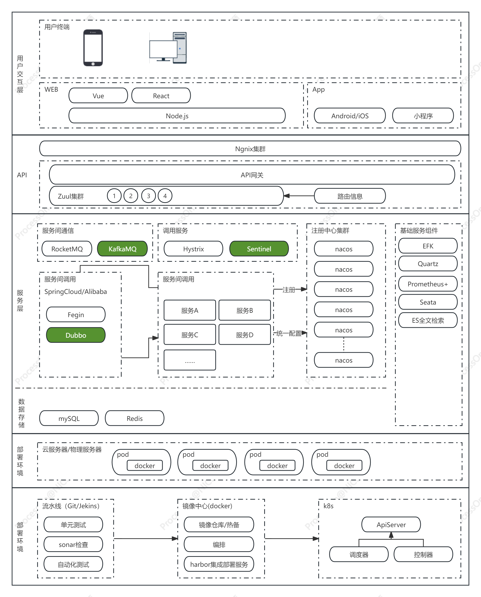

本文算是《搭建医疗 AI 应用》这个系统的前言，我计划花未来一段时间自建一个医疗 AI 系统，记录一下起因、愿景和目标

# 动机

- 在上一段工作期间，我认为完全可以实现一个住院临床使用协助护士评估护理计划合理性的产品，但是从别人眼光中看出了不相信，所以想 BATTLE 一下，表示一下不服
- 通过构建这个系统来实践 SpringCloudAlibaba
- 通过构建这个系统来学习和实践 AI 系统开发
- 通过文章记录的方式来分享学习过程，教学相长嘛

# 愿景与目标

- 2023-11-5
  - 构建一个基于患者电子病历数据相关的 AI 应用，初步以评估治疗/护理方案为目标
  - 将此项目开源，用于交流与互相学习
  - 坚决不做基于 ChatGPT 的问答系统
  - 原则上不做图像识别相关的内容（本人计算机图、影像处理相关知识严重匮乏）
  - 使用 SpringCloudAlibaba 框架，并模拟测试高并发场景，实现系统的高可用
  - 接受系统逻辑 OK，但是应用场景未必合理的假定，毕竟我们不是要做产品经理

# 系统架构构想
  - 不会去花大时间实现用户交互层面，本人不擅长前端技术
  - 不会搭建CI/CD相关的部署环境
  - 所以，本次重点实现的为从API层、服务层、存储层三部分内容
   
  

  
# AI 愿景
- 2023-11-5
  - 构建一个给住院医生用于生成治疗方案建议、评估治疗方案效果的辅助决策系统

# 项目地址
待更新